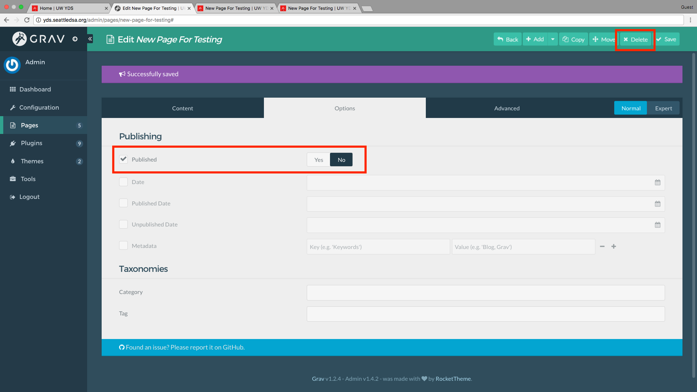

# SDSA Tech: How to Make a New Page in Grav

#### What

This is a step-by-step guide to creating a new page in Grav, the CMS of choice for Seattle DSA (and hopefully other chapters!).

> 

____

#### How

1. **Log In**

Start out by going to the Admin page, typically located at `<your-site>/admin`. This is where you can manage different parts of your site, like adding pages and plugins and changing site settings like name and theme.

> 

2. **Go to Pages**

After logging in, you'll see the Admin Dashboard, which has some useful stats and links.

> 

On the left-hand sidebar, click on **Pages** to open the *Pages Manager*.

> 

3. **Add a Page**

On the **Pages Manager**, click the *Add* button on the upper right.

> 

A little window (known as a *`modal`*) will pop up inside the page.

> 

In this modal, fill in the different text input boxes to set up some basics about the new page.

> 

The *Parent Page* dropdown lets you choose if there's a parent page. This affects where the page shows up (or if it does) in the top navigation bar. For this example, the page parent will be `/`, the root of your site.

It also changes the structure of the URL (i.e. if the parent of the new page is `home`, the new page's URL will be `<your-site>/home/<new-page>`, but you probably don't need to worry about that.
> 

The *Page Template* dropdown lets you choose a general type of page to create. This affects how the page looks by changing the page's styling (e.g. page width, header size, font size, etc.). Most typical templates are normal pages as *Default*, and blog pages as *Blog*, and there may be other useful templates in your site.

> 

Once the text input boxes are filled out, click the **Continue** button to move on to editing the body of the page.
> 

4. **Edit the New Page**

* *Content*

Now you're at the content editor, where you can add the text and images that make up the body of your new page.

> 

The text editor in Grav lets your write in plain text *and/or* [Markdown](https://en.wikipedia.org/wiki/Markdown) (Markdown is a quick and easy way to write basic HTML that can make your page look and feel better).

<!-- Need to expand here to show adding images, videos, links, etc.  -->

> 

To the upper right, just above the big text input field, you can click the *Preview* button to preview how the page will look once it's published. This is useful for making sure that your page is structured like you want and that images/videos look right. Note that this preview isn't an exact replica of your site, so there may be some differences (like font) between this preview and the page once it's published.

> 

* *Options*

Anytime during editing, you can click to the **Options** tab (your text will be saved) to change some metadata about the page. These are all optional.

> 

* *Advanced*

There's also the **Advanced** tab, where you can change some deeper settings about the page. It's a good idea not to change anything here unless you absolutely know what you're doing.

Changes on this tab could break this pages or others.

> 

5. **Save and Preview**

Once you're happy with your edits to the new page, click the *Save* button in the top right to save the page.

> 

You should then see a friendly banner that says your page has been saved!

> 

You can then click the new *Preview* Button on the top bar to preview your new page.

> 

*Preview* opens a new tab which shows your new page, live on your site! Note that this new page's title appears in the top navigation bar; this is because the parent of this page is `/`, the root, meaning that this page is seen as very important!

> 

>* **Changing Parent**

On the *Options* tab of the page editor, you can assign/re-assign a parent to your page. In this example, the parent has been changed to `/home`, the home page.

> 

In the preview, you can see that this page is now under **Home** in the top navigation bar.

> 

6. **Hiding or Deleting a Page**

If you want to remove a page from your site, you can hide or delete it. On the *Options* tab of the page editor for that page, you can choose to unpublish it (which hides the page from the live site but keeps it available in the *Page Manager* to edit or republish) or delete it (which removes the page from both your live site and the *Page Manager*).

> 

____

#### Who

Compiled by [`@therealtakeshi`](https://twitter.com/therealtakeshi) for Seattle DSA.